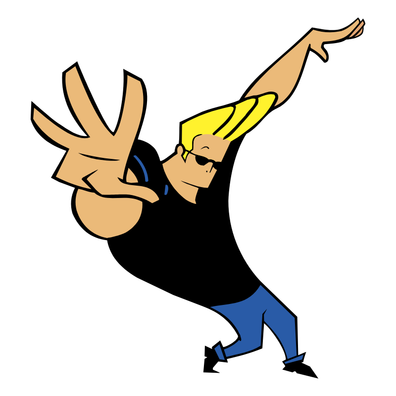

(for more deatils chek out : https://www.markdownguide.org/basic-syntax)

Headings: just like h1 to h6 we use # for headings.

# Heading 1

## Heading 2

### Headin 3

(although generally we don't go below h3 or ###)

paragraph is by default, no need to mention anything just write whatever you want

Italic: for Italic style we use one underscore before and after.

This is _Italic text_

Bold: for Bold style we use two asterisk before and after.

This is **Bold text**

Strikethrough: for strikethrough style we use two tilde sign before and after.

This is ~~strikethrough~~

Links: for links we use square bracket for link text, and parenthesis for url

[Visit Google](https://www.google.com/ "hover effect")

Images: for Images we use ! then same as links



for keywords or short code we use ` before and after

this `if-else` is conditional

Programming languages: for lang. we use ``` before and after

```JavaScript
let str = "I am Awesome!"
console.log(str)
```

Tables: for tables we use pipe sign

| Name  | Age | City     |
| ----- | --- | -------- |
| Spidy | 25  | New York |
| Thor  | 95  | Asgard   |

Quote: for quote we use >

> Things seems hard until it gets done

Ordered list and Unordered list:

1. Fruits
   - Mango
   - Papaya
   - Orange
2. Vegeies
   - Carrot
   - Peas
   - Tomato

---

---

Github flavoured extras. only works there...

[x] : box with tick sign

[ ] : black checkbox unticked

H~2~o : subscript using tilde
